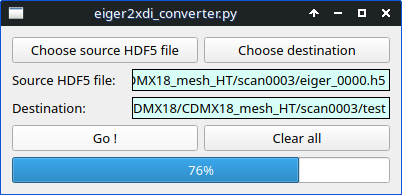

# eiger2xdi_converter

## Description

Eiger2xdi_converter is a simple graphical program to convert HDF5 files from ESRF containing X-ray diffraction images from Dectris Eiger detectors, into TIFF format. It can be used with multi-frame HDF5 files, such as those generated by the dmesh command (e.g. x-ray diffraction mapping). The program divides the HDF5 file into several TIFF images, making them suitable for use with the xdi program.

## Requirements 

Python3 packages:

* fabio
* pyqt5

## Running the Program

### From source 

Check you have the requirements above installed for your python3 distribution. Then run 
```
python3 eiger2xdi_converter.py
```
or run it through any python interpreter.

### Executable for Windows 

__Download the latest Release package for Windows ([here](https://github.com/alexisforestier/eiger2xdi_converter/releases/tag/v0.0)), unpack it, and run *eiger2xdi_converter.exe.*__ 

> [!NOTE]  
>In case of errors occurring at launch, particularly regarding module imports, it may be necessary to install Microsoft Visual C++ Redistributable. You can find it here:
>[https://learn.microsoft.com/fr-fr/cpp/windows/latest-supported-vc-redist?view=msvc-170](https://learn.microsoft.com/fr-fr/cpp/windows/latest-supported-vc-redist?view=msvc-170).

Tested on Windows 10 only.

## Use 

Use is straightforward: choose the source HDF5 file, and the destination directory for the output TIFF images.  
In some cases, the progress bar may appear stuck, but the conversion process is still running; wait for the conversions to finish.

## Example

